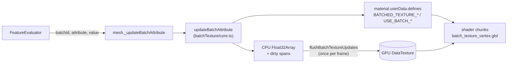
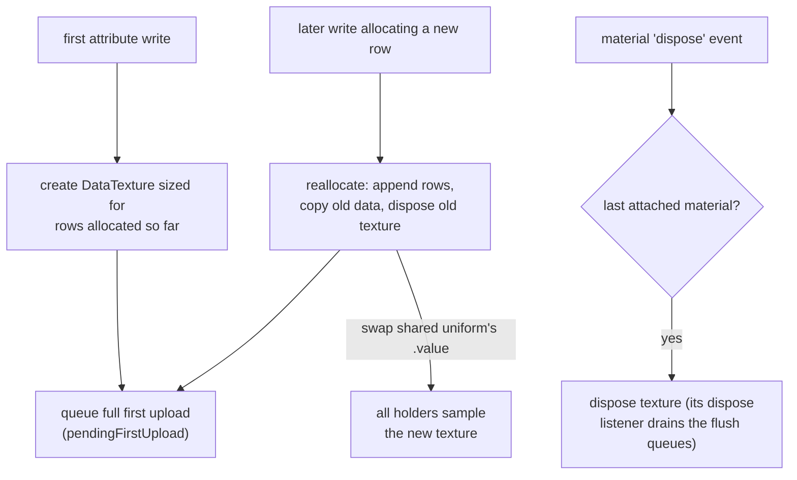
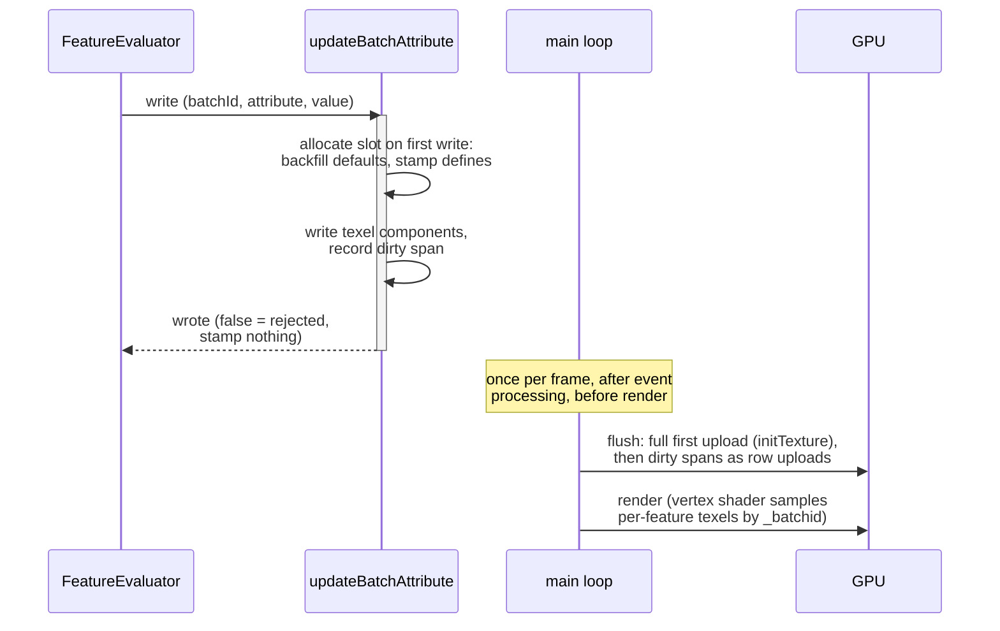

# Batch Data Texture

Per-feature style properties for batched meshes are stored in a small RGBA
float `DataTexture` per mesh (the *batch data texture*), indexed by
`_batchid` in the vertex shader. This keeps per-feature styling cost
proportional to the **feature count**, not the vertex count: restyling one
feature writes one or two texels, regardless of how many vertices the feature
has.

This guide explains the design and mechanisms. For the exact attribute set
and per-mesh capability lists, read the code: they grow over time, while the
mechanisms below stay fixed.

Core implementation: `web/navara_three/src/batchTexture/` (`core.ts`, `material.ts`, `layout.ts`, `types.ts`) and the
shader chunks `shaders/glsl/chunks/batch_texture_pars_vertex.glsl` /
`batch_texture_vertex.glsl`.

## Architecture



One `BatchTextureState` per texture holds the layout, the shared sampler
uniform, capability sets, and the set of attached materials. All queues
(dirty spans, pending first uploads) are module-global and drained by each
view's main loop with its own renderer. States are claimed per renderer, so
one view never uploads another view's textures.

## Texture layout

One texel = 4 full-precision float scalars (an RGBA float texture, so values
are stored directly with no byte encoding). Slots are **allocated
dynamically, on the first write of each attribute** (`BatchTextureLayout`),
so only styles actually used occupy texture rows. A mesh whose features are
never styled has no texture at all. Slots come in two sizes:

- **vec3** attributes take components 0-2 of a fresh row. The row's
  component 3 returns to the scalar pool.
- **Scalar** attributes take one component each, filling free components
  oldest-first (vec3 leftovers included) before opening a new row, so no
  component is wasted regardless of allocation order.

Example after styling `color`, then `show`, then `height`:

| attribute row | comp 0  | comp 1  | comp 2  | comp 3        |
| ------------- | ------- | ------- | ------- | ------------- |
| 0 (`color`)   | color.r | color.g | color.b | `showOpacity` |
| 1             | height  | (free)  | (free)  | (free)        |

The full texture is this slot layout repeated per feature: **one column per
batch ID, one row (block) per attribute**. Every feature's values for one
attribute sit side by side in that attribute's row, and one feature's whole
style is a single column:

```text
                    column = batchId (one per feature)
                 ┌───────────┬───────────┬───────────┬────
attribute row 0  │ color.rgb │ color.rgb │ color.rgb │ …
(color + show)   │ showOp →a │ showOp →a │ showOp →a │
                 ├───────────┼───────────┼───────────┼────
attribute row 1  │ height →r │ height →r │ height →r │ …
(height, 3 free) │           │           │           │
                 └───────────┴───────────┴───────────┴────
                    batch 0     batch 1     batch 2
```

Restyling one feature therefore writes one column's texels. Styling a new
attribute for the first time appends one row spanning all features (see
allocation-time defaults below).

Allocation is **append-only**: a slot never moves once assigned, so stamped
defines stay valid and growing the texture never re-scatters existing data.
Slot positions therefore depend on write order and differ between material
instances.

### 2D wrap for large batches

Texture width is capped at `MAX_BATCH_TEXTURE_WIDTH` (4096). Batch IDs
beyond the width wrap to further *batch-row groups*. The layout is planar:
each attribute row occupies one contiguous block of `batchRowGroups`
(= `ceil(batchLength / width)`) physical rows, so adding an attribute row
later is a plain append. Batch `b` lives at column `b % width`, physical row
`rowIndex * batchRowGroups + floor(b / width)` (`batchBaseIndex` in TS,
`getBatchTextureCoord` in GLSL).

For example, 10,000 features at width 4096 give `batchRowGroups = 3`, and
each attribute row becomes a 3-physical-row block:

```text
physical row
     0  ┐                        batches    0 … 4095
     1  │ attribute row 0        batches 4096 … 8191
     2  ┘ (color + show)         batches 8192 … 9999   (tail unused)
     3  ┐                        batches    0 … 4095
     4  │ attribute row 1        batches 4096 … 8191
     5  ┘ (height)               batches 8192 … 9999
```

`batchLength` is fixed once known (`initBatchDataTexture`): the batch
*count* never grows, only the attribute row count does.

## Capability gating

Each mesh type declares the attributes its shaders can receive
(`BatchTextureConfig.scalars` / `.vec3s`). These are capability lists, not
preallocations. See `POLYGON_BATCH_SUPPORT` etc. in
`web/navara_three/src/batchTexture/support.ts`
for the current lists. The list must only contain attributes with declared
receiver variables in that mesh type's shaders: a slot outside the list is
never allocated (the write is silently ignored and reported back via the
`wrote` return value), because enabling the `USE_BATCH_*` define with an
undeclared receiver breaks shader compilation.

## Slot mechanisms

New attributes reuse one of these patterns rather than inventing new ones:

- **Allocation-time defaults**: Allocating a slot backfills a **fixed
  default** for every batch before the triggering write lands — never a
  material value: `color` → white (multiplier identity), `opacity` → 1,
  `height`/`extrudedHeight` → 0, `show` → `material.visible`. Evaluator
  callbacks are expected to style an attribute for every feature once they
  style it for any, so unstyled features read these constants (do not plumb
  material state into backfills or add shader-side fallback machinery for
  them). The texture allocation is zero-filled, so a non-zero default must
  be actively backfilled.
- **Packed components**: Two half-attributes can share one component with a
  sign/bias encoding. Writes to one half unpack, merge, and repack so the
  other half survives. `show`/`opacity` use `sign(show) * (1 + opacity)`,
  where the +1 bias keeps the sign unambiguous at opacity 0
  (`packShowOpacity`). Packing also keeps the pair a single texel fetch.
- **Paired slots**: Attributes the shader folds into one varying are
  allocated together on the first write of either, so the fold never mixes a
  written value with an uninitialized one. `emissive` (vec3) +
  `emissiveIntensity` (scalar) fold to `nvr_vEmissive = rgb × intensity` in
  the vertex stage; the pair backfills `(black, 1)` — dark, with intensity
  kept a usable identity multiplier.
- **Sentinels**: A reserved out-of-range value can mean "fall back to the
  material default" when 0 is a legal styled value (e.g. `lineWidth < 0`,
  `size < 0`).
- **CPU read-back**: `readBatchScalar` / `readBatchVec3` /
  `readBatchShowOpacity` return a written value or its backfilled default
  from the CPU-side array — the same values the shader samples. `undefined` means
  "slot never allocated": the caller falls back to its material-level
  default, mirroring the shader's un-defined path (the declutter pass reads
  sprite show/size/height this way).

## Texture lifecycle



The texture is created lazily by the first attribute write and reallocated
when a write allocates a new row (the planar layout makes growth a plain
append). All samplers keep working because every holder shares one **uniform
ref** (`getBatchTextureUniform`) whose `.value` is swapped in place. Enhancers and `onBeforeCompile` closures must
capture this ref, never the texture itself. Growth settles after the first
evaluate pass, and steady-state writes never reallocate.

Teardown piggybacks on material disposal: every attached material registers
a `dispose` listener that detaches it from the state, and the last detach
disposes the texture (`releaseBatchMaterial`). Without this, the
module-global flush queues would pin textures of unloaded tiles and disposed
views forever.

## TS ↔ GLSL contract

Allocation stamps the layout as defines on `material.userData.defines`
(merged into the program by each enhancer's `transformShader`):

- `BATCHED_TEXTURE_ROW_<ATTR>`: row index (float literal), one per
  allocated attribute
- `BATCHED_TEXTURE_COMP_<SCALAR>`: component index into the texel for
  scalar slots (int literal). vec3 slots always occupy `.rgb`.
- `BATCHED_TEXTURE_ROW_COUNT`: allocated attribute row count. The shader
  derives `batchRowGroups = texSize.y / ROW_COUNT`.

The shared chunk exposes `getBatchTexel(batchId, rowIndex)`, and each
attribute fetches its own row and component. Fetches of slots sharing a row
hit the same texel and are collapsed by the compiler.

The batch id defaults to the `_batchid` vertex attribute (per-vertex for
polygon-like meshes, per-instance for sprites). A shader whose geometry
carries no such attribute overrides the `NVR_BATCH_ID_EXPR` define before
including `batch_texture_vertex` — sdfText's glyph instances read their
feature index out of the label data texture's STATE row instead.

Feature defines (`USE_BATCH_TEXTURE`, `USE_BATCH_<ATTR>`) are enabled lazily
on first write of the corresponding attribute. `material.needsUpdate` is
only bumped when a define actually changes, so repeated per-feature writes
don't trigger program rebuilds. Enabling an attribute can also flip
material-level switches its shader path needs (e.g. batch color turns
`vertexColors` on for vColor sourcing and resets the material color to
white, so texel colors and the white backfill pass through the
`material × vColor` fold unchanged).

These defines vary **per material instance** (allocation follows write
order), and neither three.js nor the enhancers include
onBeforeCompile-injected defines in the program cache key. Therefore
`initBatchedMaterial`/`attachBatchedMaterial` wrap `customProgramCacheKey`
to append all `BATCHED_TEXTURE_*`/`USE_BATCH_*` defines, so two materials
with different layouts never share a compiled program. This wrapper is the
**single** cache-key mechanism for batch styling. Enhancer state
deliberately carries no mirror flags.

## Shared materials

Multiple materials can sample one batch texture (e.g. `PolygonOutline`
samples its polygon mesh's texture). A material joins via
`attachBatchedMaterial(source, target)`: the shared uniform ref lands on its
`userData.batchDataTexture` and every allocation stamps the layout defines
(incl. `USE_BATCH_TEXTURE`) onto all attached materials. The per-attribute
`USE_BATCH_*` toggles remain per material: the owning mesh forwards them
only for attributes the attached material's shader consumes
(`enableBatchShowOpacity()` etc. on the outline).

## Update flow



Writes go to the CPU-side array and record a dirty span (min/max column per
physical texture row). Uploads are deferred to `flushBatchTextureUpdates()`,
called once per frame by the view's main loop: each row's span becomes a
`texture.addUpdateRange` entry, so a burst of per-feature writes becomes a
few `texSubImage2D` row uploads instead of a full-texture upload per write,
and a single-feature restyle uploads one texel.

Exception: the **first** upload of a texture is always full. The WebGL2
`texStorage2D` allocation is zero-filled and allocation defaults are not
zero, so a partial first upload would corrupt untouched texels. The flush
uploads newly created textures synchronously via `renderer.initTexture`
(dropping their spans, because the writes are already part of the image
data) before applying partial ranges to the rest. Growth reuses this path:
the reallocated texture is "new" and does one full upload. A texture
disposed before its first flush (created and grown in the same frame) is
never uploaded at all.
